<div align="center">

  <!-- 3D ANIMATED HERO BANNER -->
  <a href="https://github.com/Rounik-Chakraborty">
    
  </a>

  <br />

  <!-- ANIMATED TYPING TELEMETRY -->
  <a href="https://github.com/Rounik-Chakraborty">
    
  </a>

  <!-- 3D STATUS PILLS -->
  <p align="center">
    
    
    
  </p>

  

</div>

<!-- SECTION 2: ABOUT ME & 3D NEURAL CORE -->
## 🔮 ABOUT ME & 3D NEURAL LAB

<table>
  <tr>
    <td width="55%" valign="middle">
      <h3>⚡ DEVELOPER IDENTITY</h3>
      <p>
        I am an <b>AI / Machine Learning developer</b> focused on engineering robust theoretical models into scalable, production-grade systems.
      </p>
      <p>
        My technical work spans <b>Deep Learning architectures</b>, <b>Computer Vision pipelines</b>, and high-performance inference APIs. Rather than stopping at proof-of-concept experiments, I prioritize clean architecture, automated pipelines, and low-latency deployment.
      </p>
      <p>
        <code>FOCUS</code> : <b>Algorithms → Evaluation → Optimization → Production</b>
      </p>
    </td>
    <td width="45%" align="center" valign="middle">
      
    </td>
  </tr>
</table>

<div align="center">
  
</div>

<!-- SECTION 3: CURRENT FOCUS -->
## ⚡ CURRENT FOCUS

<table>
  <tr>
    <td width="50%" valign="top">
      <h3 align="left">🛠️ CURRENTLY BUILDING</h3>
      <ul>
        <li><b>AI-Powered Real-World Systems</b> — Autonomous agents, model pipelines, and inference services.</li>
        <li><b>Machine Learning Applications</b> — Production predictive analytics with rigorous cross-validation.</li>
        <li><b>Computer Vision Projects</b> — Spatial object detection, video stream analysis, and feature extraction.</li>
        <li><b>Research-Oriented Systems</b> — Reproducing benchmark architectures from research papers into clean code.</li>
      </ul>
    </td>
    <td width="50%" valign="top">
      <h3 align="left">📚 CURRENTLY EXPLORING</h3>
      <ul>
        <li><b>Advanced Machine Learning</b> — In-depth optimization algorithms, ensemble methods, and loss functions.</li>
        <li><b>Deep Learning & Neural Networks</b> — Attention mechanisms, latent space models, and modern backbones.</li>
        <li><b>Computer Vision</b> — Semantic segmentation, real-time tracking, and edge inference.</li>
        <li><b>System Design & MLOps</b> — Model serving architectures, pipeline containerization, and latency profiling.</li>
      </ul>
    </td>
  </tr>
</table>

<div align="center">
  
</div>

<!-- SECTION 4: FEATURED PROJECTS -->
## 🚀 FEATURED PROJECTS

<table width="100%">
  <!-- PROJECT 1 -->
  <tr>
    <td width="100%">
      <h3 align="left">
        <code>01</code> &nbsp; <b>Flagship AI Project</b>
      </h3>
      <p>
        An end-to-end intelligent system designed to automate complex inference tasks with custom neural network architectures and production-grade reliability.
      </p>
      <p>
        
        
        
        
        
      </p>
      <p align="right">
        <a href="https://github.com/Rounik-Chakraborty/flagship-ai-project">
          
        </a>
      </p>
    </td>
  </tr>

  <!-- PROJECT 2 -->
  <tr>
    <td width="100%">
      <h3 align="left">
        <code>02</code> &nbsp; <b>Flagship Research Project</b>
      </h3>
      <p>
        Research-driven implementation evaluating state-of-the-art model performance, latent space representations, and hyperparameter dynamics across benchmark datasets.
      </p>
      <p>
        
        
        
        
      </p>
      <p align="right">
        <a href="https://github.com/Rounik-Chakraborty/ai-research-benchmarks">
          
        </a>
      </p>
    </td>
  </tr>

  <!-- PROJECT 3 -->
  <tr>
    <td width="100%">
      <h3 align="left">
        <code>03</code> &nbsp; <b>Machine Learning System</b>
      </h3>
      <p>
        Predictive analytics and classification engine with comprehensive feature engineering pipelines, cross-validation scoring, and automated model tracking.
      </p>
      <p>
        
        
        
        
      </p>
      <p align="right">
        <a href="https://github.com/Rounik-Chakraborty/predictive-ml-system">
          
        </a>
      </p>
    </td>
  </tr>

  <!-- PROJECT 4 -->
  <tr>
    <td width="100%">
      <h3 align="left">
        <code>04</code> &nbsp; <b>Computer Vision Pipeline</b>
      </h3>
      <p>
        Real-time visual stream processor implementing feature detection, spatial bounding analysis, and multi-threaded video inference.
      </p>
      <p>
        
        
        
        
      </p>
      <p align="right">
        <a href="https://github.com/Rounik-Chakraborty/computer-vision-pipeline">
          
        </a>
      </p>
    </td>
  </tr>

  <!-- PROJECT 5 -->
  <tr>
    <td width="100%">
      <h3 align="left">
        <code>05</code> &nbsp; <b>Full-Stack AI Application</b>
      </h3>
      <p>
        Scalable microservice-backed AI solution connecting high-throughput machine learning inference APIs with responsive frontend interfaces and containerized deployments.
      </p>
      <p>
        
        
        
        
        
      </p>
      <p align="right">
        <a href="https://github.com/Rounik-Chakraborty/fullstack-ai-system">
          
        </a>
      </p>
    </td>
  </tr>
</table>

<div align="center">
  
</div>

<!-- SECTION 5: TECH STACK -->
## 🧬 TECH STACK & ARSENAL

<div align="center">

  <!-- LANGUAGES -->
  <p>
    
    <br />
    
    
    
  </p>

  <!-- AI & MACHINE LEARNING -->
  <p>
    
    <br />
    
    
    
    
  </p>

  <!-- DATA SCIENCE & VISION -->
  <p>
    
    <br />
    
    
    
  </p>

  <!-- DEVELOPMENT & DEPLOYMENT -->
  <p>
    
    <br />
    
    
    
    
    
  </p>

</div>

<div align="center">
  
</div>

<!-- SECTION 6: GITHUB ANALYTICS -->
## 📊 SYSTEM METRICS & ANALYTICS

<div align="center">

  <table border="0" cellpadding="0" cellspacing="4">
    <tr>
      <td align="center" valign="top">
        <a href="https://github.com/Rounik-Chakraborty">
          
        </a>
      </td>
      <td align="center" valign="top">
        <a href="https://github.com/Rounik-Chakraborty">
          
        </a>
      </td>
    </tr>
    <tr>
      <td colspan="2" align="center" valign="top">
        <a href="https://github.com/Rounik-Chakraborty">
          
        </a>
      </td>
    </tr>
  </table>

</div>

<br />

<!-- SECTION 7: 3D CONTRIBUTION ACTIVITY & 3D SNAKE -->
## 📈 3D CONTRIBUTION ACTIVITY

<div align="center">

  <!-- 3D ACTIVITY GRAPH -->
  <a href="https://github.com/Rounik-Chakraborty">
    
  </a>

  <br /><br />

  <!-- 3D SNAKE ANIMATION (Dark Purple Theme) -->
  <picture>
    <source media="(prefers-color-scheme: dark)" srcset="https://raw.githubusercontent.com/Rounik-Chakraborty/Rounik-Chakraborty/output/github-contribution-grid-snake-dark.svg" />
    <source media="(prefers-color-scheme: light)" srcset="https://raw.githubusercontent.com/Rounik-Chakraborty/Rounik-Chakraborty/output/github-contribution-grid-snake-dark.svg" />
    
  </picture>

</div>

<div align="center">
  
</div>

<!-- SECTION 8: ACTIVITY / CURRENT WORK -->
## 🛰️ ACTIVE DISPATCH & FOCUS

```text
┌── [ 3D TELEMETRY // CURRENT ENGINEERING LAB ] ────────────────────────────────┐
│  ► Model Optimization: Implementing quantization & ONNX runtime acceleration  │
│  ► Computer Vision: Training multi-object detection & spatial tracking models │
│  ► Engineering Rigor: Continuous integration, unit testing, and Docker builds │
└───────────────────────────────────────────────────────────────────────────────┘
```

---

<!-- SECTION 9: DEVELOPMENT PHILOSOPHY -->
## 🧠 ENGINEERING PRINCIPLE

<div align="center">

> *"Build deeply. Understand completely. Improve continuously."*

<p align="center">
  <code>PRECISION OVER HYPERBOLE</code> &nbsp;•&nbsp; <code>CODE OVER PROMISES</code> &nbsp;•&nbsp; <code>ARCHITECTURE OVER HACKS</code>
</p>

</div>

<div align="center">
  
</div>

<!-- SECTION 10: CONNECT -->
## 🌐 CONNECT & COLLABORATE

<div align="center">

  <p>Open for technical collaboration, AI/ML research inquiries, and engineering opportunities.</p>

  <p align="center">
    <a href="https://linkedin.com/in/YOUR_LINKEDIN_USERNAME" target="_blank">
      
    </a>
    &nbsp;
    <a href="mailto:mystelrounik@gmail.com">
      
    </a>
    &nbsp;
    <a href="https://YOUR_PORTFOLIO_URL" target="_blank">
      
    </a>
    &nbsp;
    <a href="https://github.com/Rounik-Chakraborty" target="_blank">
      
    </a>
  </p>

  <br />

  <sub>Designed with futuristic 3D animated black & purple aesthetics. Built for AI / Machine Learning developers.</sub>

</div>
